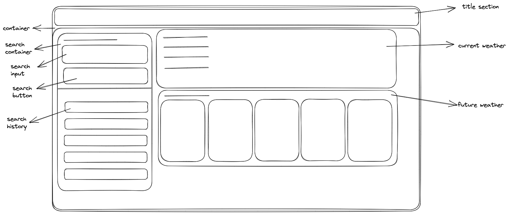

# WEATHER-FORECAST

## Description

### What to be done

The challenge is to build a weather dashboard that will run in the browser and feature dynamically updated HTML and CSS. A third-party APIs is used to access data and functionality by making requests with specific parameters to a URL. Weather dashboard is displayed with city name and its current and future weather forecast details.
### Things Done

1. When searching a city then the dashboard is presented with current and future conditions for that city and the city is added to the search history.

- It is done by using a third party '5 Day weather forecast API'.

- A logic is used to first retrive the latitude and longitude of a city and the results are used to fetch the actual weather reports.

2. When viewing the current weather condition for the city then it is presented with a city name, the date, an icon representation of weather conditions,the temperature,the humidity and the wind speed.

- It is displayed as a card using Bootstrap dynamically through javascript.

3. The future weather conditions for the city is presented with a 5-day forecast that displays the date, an icon representations of weather condition, the temperature, the wind speed, and the humidity.

- It is displayed as a card using bootstrap dynamically through javascript.

4. All searched cities should be displayed in search history and by clicking we are presented with current and future conditions for that city.

- Local storage is used to store all the searched cities.

## Wireframes Screenshot

## Deployed Screenshot and URL

